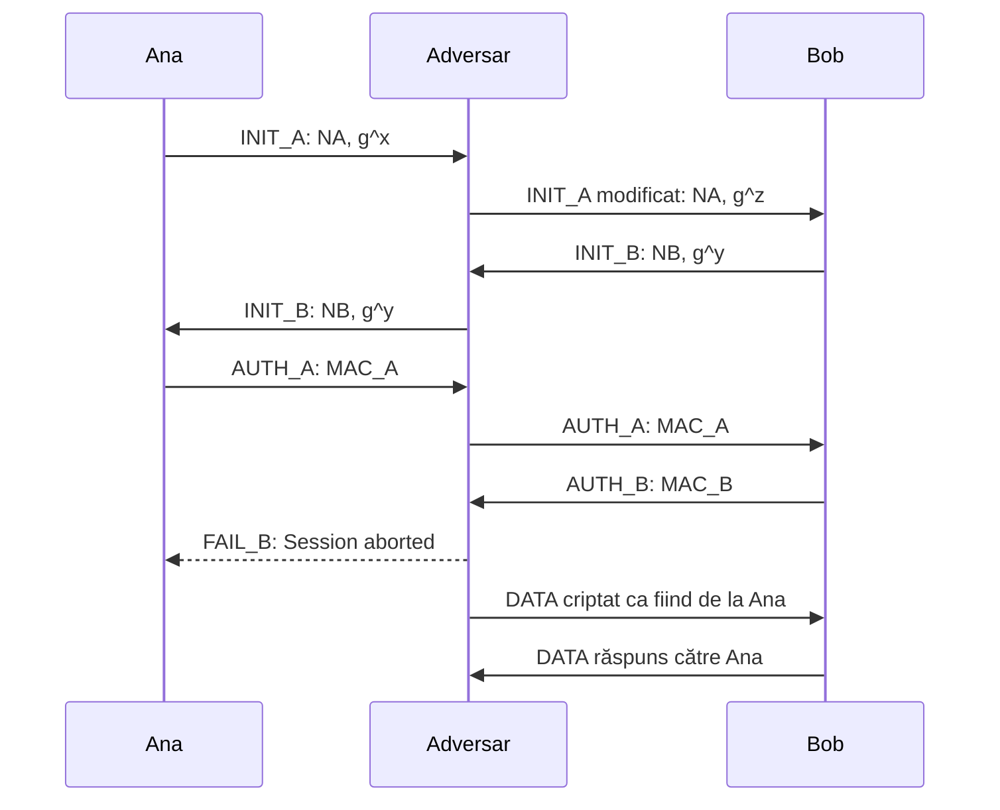

# Trace — Atac ILV asupra MAKE-MAC-DH-M4

## Test rulat

```text
TEST_ATK_ILV_MAKE_MAC_DH_M4
```

Protocol vulnerabil atacat:

```text
MAKE_MAC_DH_M4_ILV
```

Adversar folosit:

```text
ATK_ILV_MAKE_MAC_DH_M4
```

Acest test demonstrează un atac de tip **Interleaving** asupra variantei vulnerabile `MAKE_MAC_DH_M4_ILV`.

În acest scenariu apar trei entități:

* `ana` — participantul onest inițiator;
* `bob` — participantul onest responder;
* `adv` — adversarul activ.

Scopul atacului este ca Bob să ajungă în starea `ESTABLISHED` crezând că a stabilit o sesiune cu Ana, deși cheia de sesiune este stabilită cu adversarul.

---

## Ideea atacului

Atacul nu sparge primitivele criptografice folosite de protocol.

Adversarul:

* nu află cheia pre-partajată `PSK`;
* nu sparge algoritmul MAC;
* nu rezolvă problema Diffie-Hellman;
* nu modifică direct autentificatorul MAC al Anei.

Vulnerabilitatea apare deoarece autentificatorul MAC din varianta `MAKE_MAC_DH_M4_ILV` nu acoperă complet transcriptul sesiunii.

Cu alte cuvinte, MAC-ul Anei este valid, dar nu autentifică toate datele care ar trebui legate de sesiunea curentă. Din acest motiv, adversarul poate modifica valoarea publică Diffie-Hellman și poate reutiliza un autentificator valid într-un context greșit.

Problema nu este algoritmul MAC, ci datele introduse în MAC.

---

## Fluxul atacului



În acest flux:

* `g^x` este valoarea publică Diffie-Hellman generată de Ana;
* `g^z` este valoarea publică Diffie-Hellman introdusă de adversar;
* `g^y` este valoarea publică Diffie-Hellman generată de Bob.

Bob crede că valoarea `g^z` aparține Anei, dar în realitate ea aparține adversarului.

---

## Etapele principale ale trace-ului

### 1. Ana inițiază protocolul

Trace-ul începe cu Ana în starea `START`.

Ana construiește mesajul `INIT_A` către Bob:

```text
[KeyEx: ana] build InitMsg to bob, new state INIT_SENT
[Comm] MsgHeader: { INIT_A from ana to bob sid 799DDD9BAE18BEB2 }
```

Mesajul `INIT_A` conține:

* nonce-ul Anei;
* valoarea publică Diffie-Hellman a Anei.

Într-o execuție normală, acest mesaj ar trebui să ajungă direct la Bob.

În acest test, mesajul este interceptat de adversar.

---

### 2. Adversarul interceptează `INIT_A`

Adversarul primește mesajul trimis de Ana:

```text
[AdvKeyEx: adv] recv InitMsg in state START from ana to bob
```

Apoi trimite către Bob un mesaj `INIT_A` falsificat:

```text
[AdvKeyEx: adv] send forged InitAB to bob, new state INIT_SENT
```

Aceasta este etapa esențială a atacului.

Adversarul păstrează mesajul ca fiind aparent de la Ana către Bob, dar înlocuiește valoarea publică Diffie-Hellman cu propria valoare. Astfel, Bob va calcula ulterior cheia de sesiune cu adversarul, nu cu Ana.

---

### 3. Bob răspunde cu `INIT_B`

Bob primește mesajul falsificat ca și cum ar veni de la Ana:

```text
[KeyEx: bob] recv InitMsg in state START
[KeyEx: bob] build InitMsg to ana, new state INIT_RCVD
```

Bob construiește mesajul `INIT_B`, care conține:

* nonce-ul lui Bob;
* valoarea publică Diffie-Hellman a lui Bob.

Din perspectiva lui Bob, protocolul pare normal. El crede că răspunde Anei.

---

### 4. Adversarul generează chei cu Bob și retransmite `INIT_B`

Adversarul primește mesajul `INIT_B` de la Bob:

```text
[AdvKeyEx: adv] recv InitMsg in state INIT_SENT from bob to ana
```

Trace-ul arată apoi că adversarul generează chei de sesiune cu Bob:

```text
[AdvKeyEx: adv] Generated session keys with Bob.
```

Această linie este foarte importantă. Ea confirmă că adversarul poate calcula materialul criptografic comun cu Bob, deoarece Bob a folosit valoarea publică Diffie-Hellman introdusă de adversar.

După aceea, adversarul retransmite mesajul `INIT_B` către Ana:

```text
[AdvKeyEx: adv] relay InitBA to ana, new state INIT_RCVD
```

Ana primește un mesaj valid de la Bob și continuă execuția protocolului.

---

### 5. Ana construiește `AUTH_A`

Ana primește mesajul `INIT_B` și construiește mesajul de autentificare:

```text
[KeyEx: ana] recv InitMsg in state INIT_SENT
[KeyEx: ana] build AuthMsg to bob, new state AUTH_SENT
```

Mesajul `AUTH_A` conține:

```text
auth[32]
```

Acest câmp reprezintă autentificatorul MAC calculat de Ana folosind cheia pre-partajată.

MAC-ul este real și valid. Adversarul nu îl falsifică și nu are nevoie să cunoască cheia PSK.

---

### 6. Adversarul retransmite `AUTH_A` către Bob

Adversarul primește mesajul `AUTH_A` de la Ana:

```text
[AdvKeyEx: adv] recv AuthMsg in state INIT_RCVD from ana to bob
```

Apoi îl retransmite către Bob:

```text
[AdvKeyEx: adv] relay AuthAB to bob, new state AUTH_SENT
```

Bob primește un MAC valid al Anei.

Deoarece autentificatorul nu acoperă complet transcriptul sesiunii, Bob nu detectează că valoarea Diffie-Hellman folosită în sesiunea lui nu este cea generată de Ana, ci cea introdusă de adversar.

---

### 7. Bob autentifică greșit sesiunea

Bob verifică autentificatorul Anei cu succes:

```text
[KeyEx: bob] Successful verification of ana's authenticator (MAC-PSK-DHE-VULN)
Successful authentication: remote user is ana
```

Aceasta este partea critică a atacului.

Bob crede că a autentificat-o pe Ana, dar cheia de sesiune este stabilită cu adversarul.

Bob construiește mesajul `AUTH_B` și finalizează handshake-ul:

```text
[KeyEx: bob] Responder: Auth handshake done, state ESTABLISHED. Success
```

Bob ajunge astfel în starea `ESTABLISHED`, deși partenerul real al sesiunii este adversarul.

---

### 8. Adversarul finalizează atacul

Adversarul primește mesajul `AUTH_B` de la Bob:

```text
[AdvKeyEx: adv] recv AuthMsg in state AUTH_SENT from bob to ana
```

Trace-ul confirmă direct succesul atacului:

```text
[AdvKeyEx: adv] Attack successful, state ESTABLISHED. Bob believes peer is ana
```

Această linie arată că adversarul a reușit să finalizeze o sesiune criptografică validă cu Bob.

Mai grav, Bob crede că partenerul sesiunii este Ana.

---

### 9. Ana este scoasă din sesiune

După ce atacul reușește, adversarul trimite către Ana un mesaj de eșec:

```text
[AdvKeyEx: adv] sendFail to ana: Session aborted
[Comm] MsgHeader: { FAIL_B from bob to ana sid 799DDD9BAE18BEB2 }
```

Ana primește mesajul și trece în starea `FAILED`:

```text
[KeyEx: ana] recvFail, new state FAILED (Fail). From bob: Session aborted
```

Astfel, Ana nu finalizează sesiunea, în timp ce Bob rămâne în `ESTABLISHED`.

---

## Starea finală după atac

Trace-ul arată clar rezultatul atacului:

```text
[Party: ana] 1 sessions
Session[0]: sid 799DDD9BAE18BEB2 from ana to bob state FAILED

[Party: bob] 1 sessions
Session[0]: sid 799DDD9BAE18BEB2 from bob to ana state ESTABLISHED

[Party: adv] 1 sessions
Session[0]: sid 799DDD9BAE18BEB2 from adv to bob state ESTABLISHED
```

Interpretarea este:

* Ana nu finalizează protocolul;
* Bob finalizează protocolul și crede că vorbește cu Ana;
* adversarul finalizează o sesiune validă cu Bob;
* cheia de sesiune a lui Bob este comună cu adversarul, nu cu Ana.

Acesta este rezultatul care demonstrează succesul atacului Interleaving.

---

## Comunicația după atac

După finalizarea atacului, sistemul devine pregătit pentru comunicație:

```text
>> Key exchange / interleaving attack finished (success) <<
>> System ready for communications <<
```

Adversarul trimite un mesaj către Bob:

```text
Party[adv]: sends message to bob
```

Mesajul transmis este:

```text
Dear Bob, transfer $100 to Sam.
Thanks, Ana
```

Bob primește mesajul și îl acceptă ca fiind de la Ana:

```text
Party[bob]: rcvd message from adv (ana). Accepted
```

Aceasta este demonstrația practică a atacului.

Bob nu doar că a ajuns în `ESTABLISHED`, ci acceptă și mesaje protejate de la adversar, interpretându-le ca provenind de la Ana.

Bob răspunde apoi către Ana:

```text
Party[bob]: sends message to ana
```

Dar mesajul este primit de adversar:

```text
Party[adv]: rcvd message from bob (bob). Accepted
```

Astfel, adversarul este partenerul real al sesiunii cu Bob.

---

## De ce atacul reușește

Atacul reușește deoarece autentificatorul MAC din varianta vulnerabilă nu leagă complet datele sesiunii.

Un protocol sigur trebuie să autentifice explicit:

* identitatea participanților;
* nonce-urile;
* valorile publice Diffie-Hellman;
* cheia rezultată;
* direcția mesajelor;
* contextul sesiunii;
* transcriptul complet relevant.

În această variantă, MAC-ul este valid, dar este calculat pe date insuficiente. Din acest motiv, adversarul poate introduce propria valoare Diffie-Hellman și poate reutiliza autentificatorul Anei.

Prin urmare, problema nu este că MAC-ul ar fi nesigur. Problema este că MAC-ul nu este legat de toate datele relevante ale sesiunii.

---

## Diferență față de atacul pe varianta SIG-PKC

Atacul este foarte asemănător cu cel asupra variantei `MAKE_SIG_DH_M4_ILV`.

Diferența este mecanismul de autentificare:

* în varianta `SIG-PKC`, autentificatorul este o semnătură digitală;
* în varianta `MAC-PSK`, autentificatorul este un MAC calculat cu o cheie pre-partajată.

În ambele cazuri, autentificatorul este valid criptografic, dar insuficient ca proiectare de protocol.

Rezultatul este același: Bob ajunge să creadă că are o sesiune cu Ana, deși sesiunea reală este cu adversarul.

---

## Concluzie

Trace-ul demonstrează cu succes atacul Interleaving asupra protocolului `MAKE_MAC_DH_M4_ILV`.

Rezultatele importante sunt:

* adversarul interceptează mesajul `INIT_A` al Anei;
* adversarul înlocuiește valoarea publică Diffie-Hellman cu propria valoare;
* Bob primește mesajul modificat, dar îl asociază cu Ana;
* Ana generează un MAC real, care este retransmis de adversar;
* Bob verifică MAC-ul cu succes și crede că a autentificat-o pe Ana;
* adversarul stabilește chei de sesiune cu Bob;
* Ana ajunge în starea `FAILED`;
* Bob și adversarul ajung în starea `ESTABLISHED`;
* Bob acceptă mesaje de la adversar ca fiind mesaje de la Ana.

Atacul arată că un MAC valid nu este suficient pentru securitatea unui protocol. Este esențial ca MAC-ul să acopere transcriptul corect al sesiunii și să lege identitatea participantului de cheia Diffie-Hellman și de contextul protocolului.
