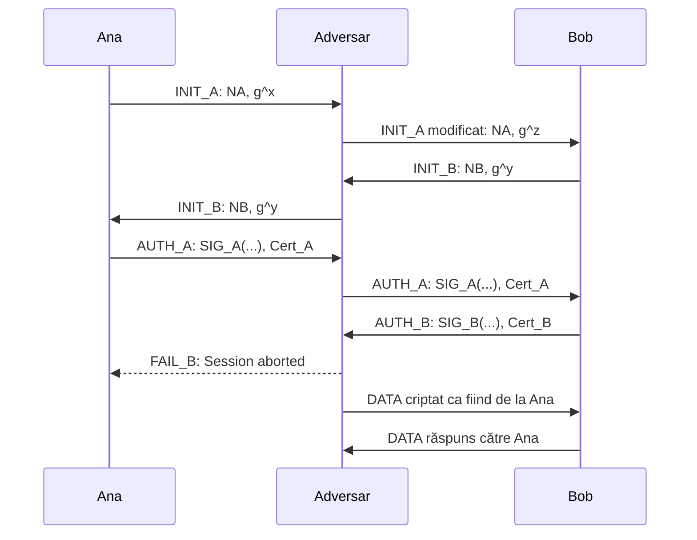

# Trace — Atac ILV asupra MAKE-SIG-DH-M4

## Test rulat

```text
TEST_ATK_ILV_MAKE_SIG_DH_M4
```

Protocol vulnerabil atacat:

```text
MAKE_SIG_DH_M4_ILV
```

Adversar folosit:

```text
ATK_ILV_MAKE_SIG_DH_M4
```

Acest test demonstrează un atac de tip **Interleaving** asupra variantei vulnerabile `MAKE_SIG_DH_M4_ILV`.

Spre deosebire de testele funcționale cu doi participanți onești, aici apare un adversar activ, notat `adv`, care interceptează, modifică și retransmite mesaje între `ana` și `bob`.

Scopul atacului este ca Bob să ajungă în starea `ESTABLISHED` crezând că a stabilit o sesiune cu Ana, deși cheia de sesiune este de fapt stabilită cu adversarul.

---

## Ideea atacului

Atacul nu sparge primitivele criptografice folosite de protocol.

Adversarul:

* nu rezolvă problema Diffie-Hellman;
* nu falsifică semnătura Anei;
* nu compromite certificatul Anei;
* nu află cheia privată a Anei.

Vulnerabilitatea apare deoarece autentificatorul din varianta `MAKE_SIG_DH_M4_ILV` nu acoperă complet transcriptul sesiunii.

Cu alte cuvinte, semnătura Anei este validă, dar nu semnează toate datele care ar trebui legate de sesiunea curentă.

Problema nu este semnătura digitală în sine, ci conținutul semnat.

---

## Fluxul atacului



În acest flux, `g^x` este valoarea publică Diffie-Hellman generată de Ana, iar `g^z` este valoarea publică Diffie-Hellman introdusă de adversar.

Bob primește un mesaj care pare să vină de la Ana, dar care conține cheia publică Diffie-Hellman a adversarului.

---

## Etapele principale ale trace-ului

### 1. Ana inițiază protocolul

Trace-ul începe cu Ana în starea `START`.

Ana construiește mesajul `INIT_A` către Bob:

```text
[KeyEx: ana] build InitMsg to bob, new state INIT_SENT
[Comm] MsgHeader: { INIT_A from ana to bob sid D1164C0627F034E0 }
```

Mesajul `INIT_A` conține:

* nonce-ul Anei;
* valoarea publică Diffie-Hellman a Anei.

Într-o execuție normală, acest mesaj ar trebui să ajungă direct la Bob.

În acest test, mesajul este interceptat de adversar.

---

### 2. Adversarul interceptează `INIT_A`

Adversarul primește mesajul de inițializare trimis de Ana:

```text
[AdvKeyEx: adv] recv InitMsg in state START from ana to bob
```

Apoi adversarul trimite către Bob un mesaj `INIT_A` modificat:

```text
[AdvKeyEx: adv] send forged InitAB to bob, new state INIT_SENT
```

Aceasta este etapa esențială a atacului.

Adversarul păstrează identitatea aparentă a Anei, dar înlocuiește valoarea publică Diffie-Hellman cu propria valoare. Astfel, Bob crede că primește cheia publică a Anei, dar în realitate primește cheia publică a adversarului.

---

### 3. Bob răspunde cu `INIT_B`

Bob primește mesajul falsificat ca și cum ar veni de la Ana:

```text
[KeyEx: bob] recv InitMsg in state START
[KeyEx: bob] build InitMsg to ana, new state INIT_RCVD
```

Bob construiește mesajul `INIT_B`, care conține:

* nonce-ul lui Bob;
* valoarea publică Diffie-Hellman a lui Bob.

Mesajul este trimis aparent către Ana, dar trece prin adversar.

---

### 4. Adversarul retransmite `INIT_B` către Ana

Adversarul primește mesajul `INIT_B` de la Bob:

```text
[AdvKeyEx: adv] recv InitMsg in state INIT_SENT from bob to ana
```

Apoi îl retransmite către Ana:

```text
[AdvKeyEx: adv] relay InitBA to ana, new state INIT_RCVD
```

Ana primește un mesaj `INIT_B` valid de la Bob și continuă execuția protocolului.

Din perspectiva Anei, schimbul pare normal.

---

### 5. Ana construiește `AUTH_A`

Ana primește mesajul `INIT_B` și construiește mesajul de autentificare:

```text
[KeyEx: ana] recv InitMsg in state INIT_SENT
[KeyEx: ana] build AuthMsg to bob, new state AUTH_SENT
```

Mesajul `AUTH_A` conține:

```text
auth
cert
```

Câmpul `auth` este semnătura digitală a Anei, iar `cert` este certificatul acesteia.

Această semnătură este reală și validă. Adversarul nu o falsifică.

Vulnerabilitatea apare deoarece semnătura nu acoperă complet transcriptul sesiunii. Astfel, ea poate fi folosită de adversar într-un context modificat.

---

### 6. Adversarul retransmite `AUTH_A` către Bob

Adversarul primește mesajul `AUTH_A` de la Ana:

```text
[AdvKeyEx: adv] recv AuthMsg in state INIT_RCVD from ana to bob
```

Apoi îl retransmite către Bob:

```text
[AdvKeyEx: adv] relay AuthAB to bob, new state AUTH_SENT
```

Bob primește o semnătură validă a Anei și certificatul Anei.

Deoarece autentificatorul nu include complet datele sesiunii, Bob acceptă mesajul.

---

### 7. Bob autentifică greșit sesiunea

Bob verifică semnătura Anei cu succes:

```text
[KeyEx: bob] Successful verification of ana's authenticator (SIG-PKC-DHE-ILV)
Successful authentication: remote user is ana
```

Aceasta este partea critică a atacului.

Bob crede că a autentificat-o pe Ana, dar cheia Diffie-Hellman folosită în sesiune este legată de adversar, nu de Ana.

Bob construiește apoi `AUTH_B` și ajunge în starea `ESTABLISHED`:

```text
[KeyEx: bob] Responder: Auth handshake done, state ESTABLISHED. Success
```

---

### 8. Adversarul finalizează atacul

Adversarul primește mesajul `AUTH_B` de la Bob:

```text
[AdvKeyEx: adv] recv AuthMsg in state AUTH_SENT from bob to ana
```

Apoi trace-ul confirmă direct succesul atacului:

```text
[AdvKeyEx: adv] Generated session keys with Bob.
[AdvKeyEx: adv] Attack successful, state ESTABLISHED. Bob believes peer is ana
```

Aceasta arată că adversarul a reușit să stabilească o sesiune criptografică validă cu Bob.

Mai grav, Bob crede că partenerul sesiunii este Ana.

---

### 9. Ana este scoasă din sesiune

După ce atacul reușește, adversarul trimite către Ana un mesaj de eșec:

```text
[AdvKeyEx: adv] sendFail to ana: Session aborted
[Comm] MsgHeader: { FAIL_B from bob to ana sid D1164C0627F034E0 }
```

Ana primește mesajul și trece în starea `FAILED`:

```text
[KeyEx: ana] recvFail, new state FAILED (Fail). From bob: Session aborted
```

Astfel, Ana nu finalizează sesiunea, dar Bob rămâne în `ESTABLISHED`.

---

## Starea finală după atac

Trace-ul arată clar rezultatul atacului:

```text
[Party: ana] 1 sessions
Session[0]: sid D1164C0627F034E0 from ana to bob state FAILED

[Party: bob] 1 sessions
Session[0]: sid D1164C0627F034E0 from bob to ana state ESTABLISHED

[Party: adv] 1 sessions
Session[0]: sid D1164C0627F034E0 from adv to bob state ESTABLISHED
```

Interpretarea este:

* Ana nu finalizează protocolul;
* Bob finalizează protocolul și crede că vorbește cu Ana;
* adversarul finalizează o sesiune validă cu Bob;
* cheia de sesiune a lui Bob este comună cu adversarul, nu cu Ana.

Acesta este rezultatul care demonstrează succesul atacului Interleaving.

---

## Comunicația după atac

După finalizarea atacului, sistemul devine pregătit pentru comunicație:

```text
>> Key exchange / interleaving attack finished (success) <<
>> System ready for communications <<
```

Adversarul trimite un mesaj către Bob:

```text
Party[adv]: sends message to bob
```

Mesajul transmis este:

```text
Dear Bob, transfer $100 to Sam.
Thanks, Ana
```

Bob primește mesajul și îl acceptă ca fiind de la Ana:

```text
Party[bob]: rcvd message from adv (ana). Accepted
```

Această linie este demonstrația practică a atacului.

Bob nu doar că a ajuns în `ESTABLISHED`, ci acceptă și mesaje protejate de la adversar, interpretându-le ca provenind de la Ana.

Bob răspunde apoi către Ana:

```text
Party[bob]: sends message to ana
```

Dar mesajul este primit de adversar:

```text
Party[adv]: rcvd message from bob (bob). Accepted
```

Astfel, adversarul se află efectiv în poziția de partener de sesiune al lui Bob.

---

## De ce atacul reușește

Atacul reușește deoarece autentificatorul din varianta vulnerabilă nu leagă complet:

* identitatea Anei;
* nonce-urile;
* valorile publice Diffie-Hellman;
* cheia rezultată;
* direcția mesajelor;
* transcriptul complet al sesiunii.

Semnătura Anei este validă, dar este folosită într-un context greșit.

În varianta sigură, semnătura trebuie să includă suficiente date din sesiune astfel încât orice modificare a valorii Diffie-Hellman sau a contextului protocolului să ducă la eșecul verificării.

---

## Concluzie

Trace-ul demonstrează cu succes atacul Interleaving asupra protocolului `MAKE_SIG_DH_M4_ILV`.

Rezultatele importante sunt:

* adversarul interceptează mesajul `INIT_A` al Anei;
* adversarul modifică valoarea publică Diffie-Hellman;
* Bob primește mesajul modificat, dar îl asociază cu Ana;
* Ana generează o semnătură reală, care este retransmisă de adversar;
* Bob verifică semnătura cu succes și crede că a autentificat-o pe Ana;
* adversarul generează chei de sesiune cu Bob;
* Ana ajunge în starea `FAILED`;
* Bob și adversarul ajung în starea `ESTABLISHED`;
* Bob acceptă mesaje de la adversar ca fiind mesaje de la Ana.

Atacul arată că o semnătură digitală validă nu este suficientă pentru securitatea unui protocol. Este esențial ca semnătura să acopere transcriptul corect al sesiunii și să lege identitatea participantului de cheia Diffie-Hellman și de contextul protocolului.
